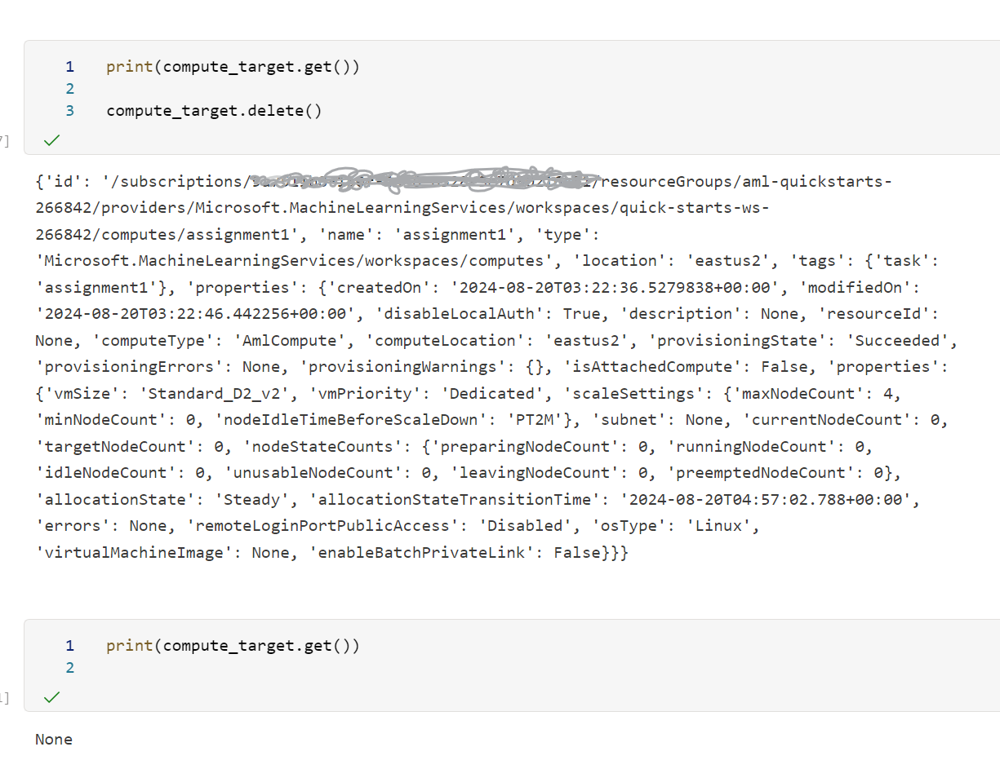

# Optimizing an ML Pipeline in Azure

## Overview
This project is part of the Udacity Azure ML Nanodegree.
In this project, we build and optimize an Azure ML pipeline using the Python SDK and a provided Scikit-learn model.
This model is then compared to an Azure AutoML run.

## Useful Resources
- [ScriptRunConfig Class](https://docs.microsoft.com/en-us/python/api/azureml-core/azureml.core.scriptrunconfig?view=azure-ml-py)
- [Configure and submit training runs](https://docs.microsoft.com/en-us/azure/machine-learning/how-to-set-up-training-targets)
- [HyperDriveConfig Class](https://docs.microsoft.com/en-us/python/api/azureml-train-core/azureml.train.hyperdrive.hyperdriveconfig?view=azure-ml-py)
- [How to tune hyperparamters](https://docs.microsoft.com/en-us/azure/machine-learning/how-to-tune-hyperparameters)

## Summary
- Dataset is a [Bank marketing dataset](https://automlsamplenotebookdata.blob.core.windows.net/automl-sample-notebook-data/bankmarketing_train.csv) with features about customers and campaigns related information, with column (y) as flag for if customer has opted for term deposit or not. using a classification model on this dataset we want to predict whether the customer will subscribe to term deposit or not.

- we used classification model with AUC_weighted primary metric for evaluation and got `VotingEnsemble` as best performing model by AutoML.
- Different models and configuration pipelines (35) were executed and evaluated by AutoML
- `LightGBM`, `XGBoostClassifier` were other 2 in top 3 models but `VotingEnsemble` was best performing.

## Scikit-learn Pipeline
**Explain the pipeline architecture, including data, hyperparameter tuning, and classification algorithm.**
- After downloading data, operation to that cleans and preprocesses a dataset by handling missing values, encoding categorical variables into numerical ones, and mapping specific string values to integers was performed.
- after cleaningup the data, data was split into train and test sets.

**What are the benefits of the parameter sampler you chose?**
- we used `RandomParameterSampling` as parameter sampler to explore the hyperparameters `inverse regularization strength (C)` ranging from 0.5 to 1.5, and `max iterations` with choices of 50, 100, and 150. Unlike exhaustive grid search, This method does not exhaustively search all possible combinations, but it randomly selects a subset, which significantly reduces the computational cost and time required and more efficient

**What are the benefits of the early stopping policy you chose?**
- for early stopping we used `BanditPolicy` as it helps in saving computational resources by terminating underperforming runs early. i.e. if a run’s performance is significantly worse (10% below the best run) during intermediate evaluations, it is stopped.

## AutoML
**In 1-2 sentences, describe the model and hyperparameters generated by AutoML.**

- AutoML picked `VotingEnsemble` as the best model out of 36 pipelines it executed with different models and different hyperparameter settings.
- 
- The AutoMLConfig included `experiment_timeout_minutes` and `max_concurrent_iterations` ensure the process is time-efficient and resource-effective. The `primary_metric` of `AUC_weighted` and `n_cross_validations` provide a robust evaluation of model performance
- you can view logs in log files.
- other models and their metric is as below.

|ITER|PIPELINE|DURATION|METRIC|BEST|
|----|----|----|----|----|
|0|MaxAbsScaler|LightGBM|0:00:13|0.9493|0.9493|
|1|MaxAbsScaler|XGBoostClassifier|0:00:30|0.9455|0.9493|
|2|MaxAbsScaler|ExtremeRandomTrees|0:00:17|0.9044|0.9493|
|3|MaxAbsScaler|RandomForest|0:00:15|0.9038|0.9493|
|4|StandardScalerWrapper|LightGBM|0:00:10|0.9310|0.9493|
|5|SparseNormalizer|XGBoostClassifier|0:00:11|0.9454|0.9493|
|6|SparseNormalizer|RandomForest|0:00:34|0.9352|0.9493|
|10|SparseNormalizer|LightGBM|0:00:10|0.9342|0.9493|
|7|StandardScalerWrapper|XGBoostClassifier|0:00:16|0.9357|0.9493|
|11|MaxAbsScaler|ExtremeRandomTrees|0:00:38|0.8190|0.9493|
|12|StandardScalerWrapper|XGBoostClassifier|0:00:17|0.9455|0.9493|
|8|SparseNormalizer|XGBoostClassifier|0:00:18|0.9440|0.9493|
|13|StandardScalerWrapper|ExtremeRandomTrees|0:00:16|0.8144|0.9493|
|14|StandardScalerWrapper|RandomForest|0:02:24|0.9392|0.9493|
|15|MaxAbsScaler|LightGBM|0:00:19|0.9472|0.9493|
|9|MaxAbsScaler|RandomForest|0:00:09|0.8477|0.9493|
|16|MaxAbsScaler|LogisticRegression|0:00:14|0.9349|0.9493|
|17|StandardScalerWrapper|ExtremeRandomTrees|0:01:58|0.9174|0.9493|
|21|StandardScalerWrapper|XGBoostClassifier|0:00:31|0.9433|0.9493|
|18|StandardScalerWrapper|XGBoostClassifier|0:00:16|0.9447|0.9493|
|19|MaxAbsScaler|ExtremeRandomTrees|0:00:19|0.8315|0.9493|
|20|MaxAbsScaler|LogisticRegression|0:00:33|0.9307|0.9493|
|22|StandardScalerWrapper|XGBoostClassifier|0:00:41|0.9462|0.9493|
|23|MaxAbsScaler|RandomForest|0:00:35|0.9117|0.9493|
|24|MaxAbsScaler|LightGBM|0:00:41|0.9460|0.9493|
|25|StandardScalerWrapper|LightGBM|0:00:28|0.9397|0.9493|
|26|StandardScalerWrapper|LogisticRegression|0:00:33|0.9325|0.9493|
|28|StandardScalerWrapper|XGBoostClassifier|0:00:56|0.9461|0.9493|
|30|SparseNormalizer|LightGBM|0:00:45|0.9338|0.9493|
|29|StandardScalerWrapper|XGBoostClassifier|0:01:54|0.9297|0.9493|
|33|StandardScalerWrapper|XGBoostClassifier|0:00:38|0.9460|0.9493|
|32|StandardScalerWrapper|XGBoostClassifier|0:01:46|0.9387|0.9493|
|34|StandardScalerWrapper|XGBoostClassifier|0:01:07|0.9408|0.9493|
|27|MaxAbsScaler|LogisticRegression|0:05:32|nan|0.9493|
|31|||0:03:33|nan|0.9493|
|35|MaxAbsScaler|LightGBM|0:00:38|0.9387|0.9493|
|36||*VotingEnsemble*|0:01:46|0.9502|0.9502||

## Pipeline comparison
**Compare the two models and their performance. What are the differences in accuracy? In architecture? If there was a difference, why do you think there was one?**

- in AutoML `VotingEnsemble` achieved the highest accuracy with a metric of 0.9502 outperforming individual models.
    - `VotingEnsemble` Combines predictions from multiple models (e.g., LightGBM, XGBoost, RandomForest) to make a final prediction. Each model votes, and the majority or weighted average determines the final output.
    - `VotingEnsemble` reduces the risk of overfitting and can handle diverse data patterns better as it leverages the strength of different models improving overall performance and robustness.
    - 
- `LightGBM` had consistently high performance with a metric of highest of 0.9493.
    - `LightGBM` is a gradient boosting framework that builds decision trees sequentially. Each new tree corrects errors made by the previous ones. 
    - `lightGBM` is known for its high speed and efficiency especially with large datasets
    - It uses histogram-based algorithms to speed up training and reduce memory usage.
- `XGBoostClassifier` also performed well, with accuracies close to LightGBM, such as 0.9455 
    - `XGBoostClassifier` is also a gradient boosting algorithm that builds trees sequentially. It includes regularization to prevent overfitting and uses a more sophisticated tree pruning algorithm.
    - `XGBoostClassifier` supports parallel processing and handles missing values internally, making it robust for various data types.
- `ExtremeRandomTrees` had lowest performance with 0.9044 as max.
    - `ExtremeRandomTrees` ensemble method that builds multiple decision trees with more randomness in the tree construction process. It selects splits randomly and averages the results
    - it can handle large datasets and high-dimensional data well.

resons of difference between model performances

    - VotingEnsemble benefits from combining multiple models, leveraging their strengths and mitigating individual weaknesses, leading to the highest accuracy.
    - LightGBM and XGBoost are specifically designed for high performance and efficiency, which likely contributed to their higher accuracy.
    - ExtremeRandomTrees and RandomForest may not capture the data patterns as effectively as gradient boosting methods, leading to lower accuracy.
    - The specific hyperparameters and configurations used in the AutoML setup might have favored LightGBM and XGBoost, resulting in better performance.

Overall, the VotingEnsemble model outperformed individual models due to its ability to aggregate the strengths of multiple algorithms, while LightGBM and XGBoostClassifier also showed strong performance due to their advanced boosting techniques and efficient handling of large datasets. ExtremeRandomTrees and RandomForest may not capture the data patterns as effectively as gradient boosting methods, leading to lower accuracy. The specific hyperparameters and configurations used in the AutoML setup might have favored LightGBM and XGBoost, resulting in better performance.

## Future work
**What are some areas of improvement for future experiments? Why might these improvements help the model?**

- addressing class imbalance
    - Downsampling: Balance the dataset by downsampling the majority class to match the minority class (in our dataset we have 2771 positive samples out of 24712, 100:11 ratior). This can help the model learn more effectively from balanced data.
    - resampling :  Increase the number of instances in the minority class by duplicating them. Techniques like SMOTE (Synthetic Minority Over-sampling Technique) can generate synthetic samples.
- Hyperparameter Tuning:
    - Exhaustive Grid Search: While it may not significantly boost performance, a more exhaustive grid search could uncover better hyperparameter combinations, potentially improving model accuracy.
- Scaling Methods:
    - Apply Scaling: Implement scaling methods (e.g., StandardScaler, MinMaxScaler) in the Logistic Regression pipeline to ensure features are on the same scale. This can lead to faster convergence and better performance.
- Model Selection for Production:
    - Avoid VotingEnsemble: For production, choose the best performing individual model (e.g., XGBoost Classifier) over VotingEnsemble to maintain inference speed and model explainability.
- Pipeline Adjustments:
    - Preprocessing and Sampling: Experiment with different preprocessing steps and sampling parameters to potentially discover better-performing models.
- Model Explainability:
    - Analyze Model Explanations: Use model explainability tools to gain insights into feature importance. This can inform custom preprocessing steps, improving both accuracy and training time.

## Proof of cluster clean up
**If you did not delete your compute cluster in the code, please complete this section. Otherwise, delete this section.**
**Image of cluster marked for deletion**

`compute_target.delete()` command used to delete cluster

